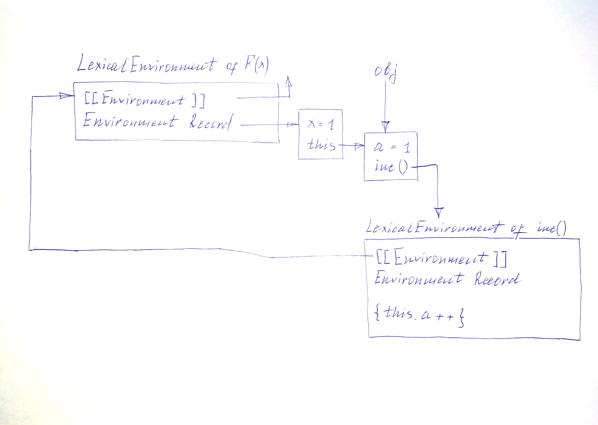

# Fun JS Tasks

### <a id="0">Contents</a>

| | | |
| --- | --- | --- |
| [Task **#1**](#1) | [Task **#2**](#2) | [Task **#3**](#3) |
| [Task **#4**](#4) | [Task **#5**](#5) | [Task **#6**](#6) |
| [Task **#7**](#7) | [Task **#8**](#8) | [Task **#9**](#9) |
| [Task **#10**](#10) | [Task **#11**](#11) | [Task **#12**](#12) |
| [Task **#13**](#13) | [Task **#14**](#14) | |

### <a id="1">Task #1</a>

```javascript
const a = [1, 2, 3]

const b = {
    0: 1,
    1: 2,
    2: 3,
}

const index = {
    valueOf() {
        return "1"
    },
    toString() {
        return 2
    },
}

//console.log(`${a[index]} ${b[index]}`)
```

<a href="#0"></a>

### <a id="2">Task #2</a>

```javascript
const a = {
    [Symbol.toPrimitive](hint) {
        return hint == "default" ? 1 : "2"
    }
}

//console.log(++a)
```

<a href="#0"></a>

### <a id="3">Task #3</a>

```javascript
const a = {
    [Symbol.toPrimitive]() {
        return "javascript" === "JavaScript"
    }
}

//console.log(!a)
```

<a href="#0"></a>

### <a id="4">Task #4</a>

```javascript
const a = {
    valueOf(hint) {
        return hint == "number" ? "1" : "2"
    }
}

//console.log(+a)
```

<a href="#0"></a>

### <a id="5">Task #5</a>

```javascript
const a = {
    toString(hint = "default") {
        return hint == "default" ? 1 : 2
    }
}

//console.log(+a)
```

<a href="#0"></a>

### <a id="6">Task #6</a>

```javascript
const str = "0xford University"

//console.log(parseInt(str))
```

<a href="#0"></a>

### <a id="7">Task #7</a>

```javascript
//"use strict"

var name = 'Masha'
var age = 35

let person = new function () {
    this.name = 'Sveta'
    this.age = 22
    this.hello = function () { console.log(`Hello, ${this.name}!`) }
    this.bye = () => { console.log(`Bye, ${this.name}!`) }
}

const user = {
    name: 'Vova',
    age: 32,
    isAdmin: false,
    happyBirthday: () => { console.log(`${this.name} is ${++this.age}.`) },

    __proto__: person,
}

//user.hello()
//user.bye()
//user.happyBirthday()
```

<a href="#0"></a>

### <a id="8">Task #8</a>

```javascript
var a = 1

function F(a) {
    this.a = a
    this.f1 = () => console.log(a)
    this.f2 = () => console.log(this.a)
    this.f3 = function () { console.log(this.a) }
    return { ...this }
}

a = new F(10)
a.a++

//for (let i = 1; i <= 3;) a['f' + i++]()
```

<a href="#0"></a>

### <a id="9">Task #9</a>

```javascript
//"use strict"

var a = 100

let obj1 = {
    a: 1,
    f() {
        this.a++
        (function () { this.a++ })() // (*)
    },
}

obj1.f()

//console.log(`obj1.a = ${obj1.a}, a = ${a}`)
```

```javascript
//"use strict"

var a = 100

let obj2 = {
    a: 1,
    f() {
        this.a++
        (() => { this.a++ })() // (*)
    },
}

obj2.f()

//console.log(`obj2.a = ${obj2.a}, a = ${a}`)
```

<a href="#0"></a>

### <a id="10">Task #10</a>

```javascript
let s = 'closure'

function f() {
    console.log(s)
}

{
    let s = 'lexical scope'
    //f()
}
```

<a href="#0"></a>

### <a id="11">Task #11</a>

```javascript
let a = 1

const f = () => {
    console.log(`%c ${a} `, 'color: white; background: red')
}

a = 2

{
    let a = 3

    if (true) {
        let a = 4
        //f()
        a = 5
    }

    a = 6
}

a = 7
```

<a href="#0"></a>

### <a id="12">Task #12</a>

```javascript
function F(x) {
    this.a = x
    this.inc = () => { this.a++ }
    //return { ...this }
}

obj = new F(1)
obj.inc()
//console.log(obj.a)
```



<a href="#0"></a>

### <a id="13">Task #13</a>

```javascript
// "use strict"

var name = 'Emma'

const creature = {
    hello() { console.log(`Hello, ${this.name || typeof this}!`) },
    bye: () => { console.log(`Bye, ${this.name || typeof this}!`) },
}

const user = {
    name: 'Alex',
    __proto__: creature,
}

//creature.hello(); creature.bye();
//user.hello(); user.bye();
```

<a href="#0"></a>

### <a id="14">Task #14</a>

```javascript
// "use strict"

var name = 'Emma'

class Creature {
    constructor() {
        this.hello = function () { console.log(`Hello, ${this.name || typeof this}!`) }
        this.bye = () => { console.log(`Bye, ${this.name || typeof this}!`) }
    }
}

const creature = new Creature()

class User extends Creature {
    constructor(name = 'Noname') {
        super()
        this.name = name
    }
}

const user = new User('Alex')

//creature.hello(); creature.bye();
//user.hello(); user.bye();
```

<a href="#0"></a>

### by

[PapaProger](https://github.com/papaproger)